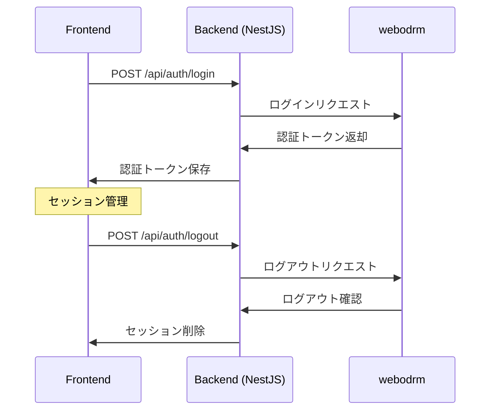
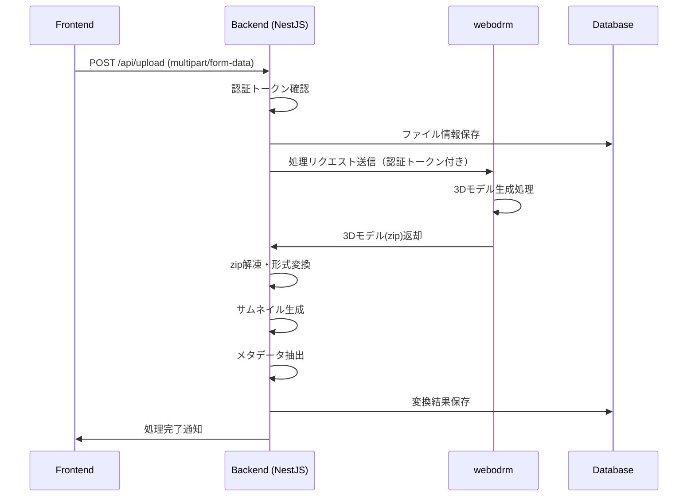
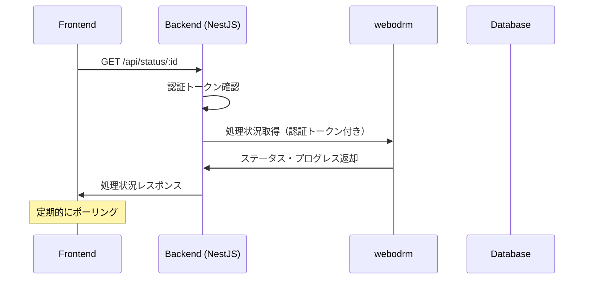
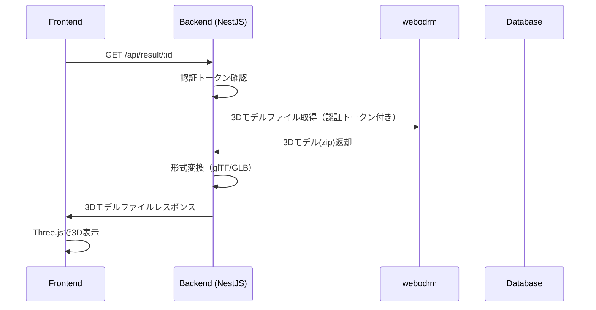
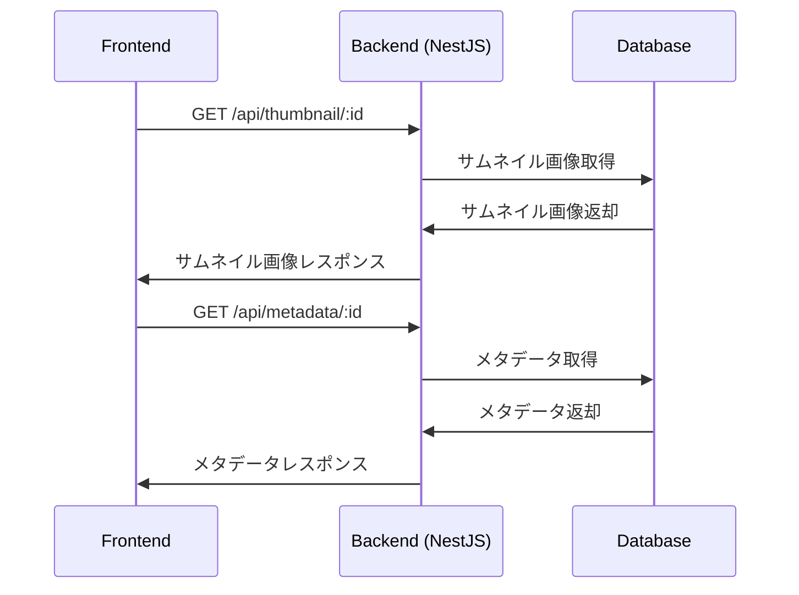
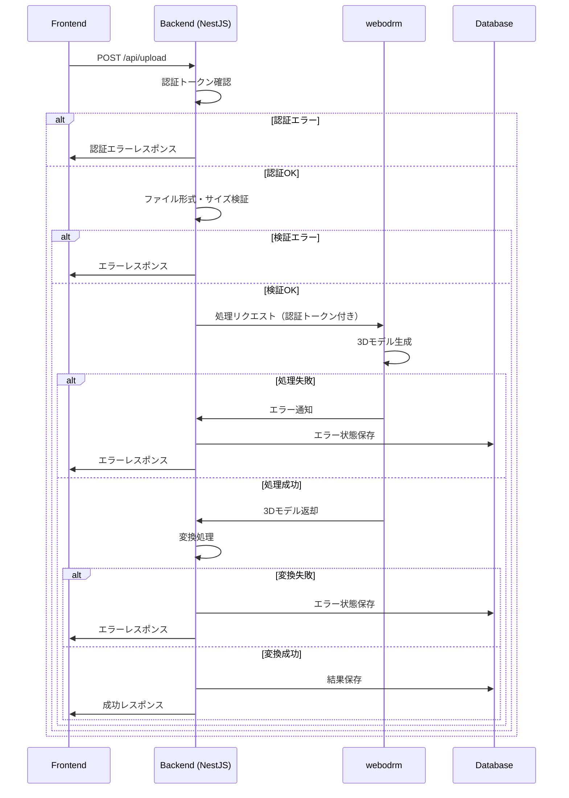
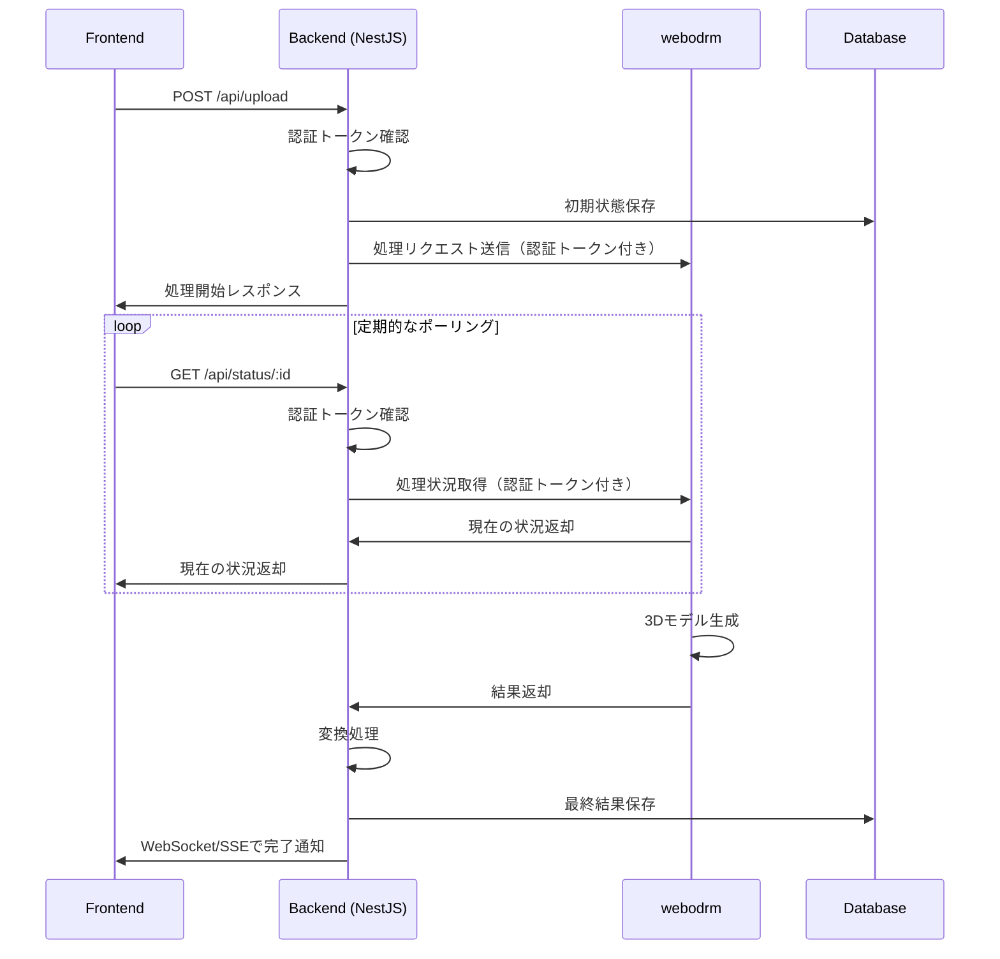

# シーケンス図

## 1. webodrm認証フロー

```mermaid
sequenceDiagram
    participant F as Frontend
    participant B as Backend (NestJS)
    participant W as webodrm

    F->>B: POST /api/auth/login
    B->>W: ログインリクエスト
    W->>B: 認証トークン返却
    B->>F: 認証トークン保存
    Note over F: セッション管理

    F->>B: POST /api/auth/logout
    B->>W: ログアウトリクエスト
    W->>B: ログアウト確認
    B->>F: セッション削除
```

## 2. ファイルアップロード・処理フロー

```mermaid
sequenceDiagram
    participant F as Frontend
    participant B as Backend (NestJS)
    participant W as webodrm
    participant DB as Database

    F->>B: POST /api/upload (multipart/form-data)
    B->>B: 認証トークン確認
    B->>DB: ファイル情報保存
    B->>W: 処理リクエスト送信（認証トークン付き）
    W->>W: 3Dモデル生成処理
    W->>B: 3Dモデル(zip)返却
    B->>B: zip解凍・形式変換
    B->>B: サムネイル生成
    B->>B: メタデータ抽出
    B->>DB: 変換結果保存
    B->>F: 処理完了通知
```

## 3. 処理状況確認フロー

```mermaid
sequenceDiagram
    participant F as Frontend
    participant B as Backend (NestJS)
    participant W as webodrm
    participant DB as Database

    F->>B: GET /api/status/:id
    B->>B: 認証トークン確認
    B->>W: 処理状況取得（認証トークン付き）
    W->>B: ステータス・プログレス返却
    B->>F: 処理状況レスポンス
    Note over F: 定期的にポーリング
```

## 4. 3Dモデル表示フロー

```mermaid
sequenceDiagram
    participant F as Frontend
    participant B as Backend (NestJS)
    participant W as webodrm
    participant DB as Database

    F->>B: GET /api/result/:id
    B->>B: 認証トークン確認
    B->>W: 3Dモデルファイル取得（認証トークン付き）
    W->>B: 3Dモデル(zip)返却
    B->>B: 形式変換（glTF/GLB）
    B->>F: 3Dモデルファイルレスポンス
    F->>F: Three.jsで3D表示
```

## 5. サムネイル・メタデータ取得フロー

```mermaid
sequenceDiagram
    participant F as Frontend
    participant B as Backend (NestJS)
    participant DB as Database

    F->>B: GET /api/thumbnail/:id
    B->>DB: サムネイル画像取得
    DB->>B: サムネイル画像返却
    B->>F: サムネイル画像レスポンス

    F->>B: GET /api/metadata/:id
    B->>DB: メタデータ取得
    DB->>B: メタデータ返却
    B->>F: メタデータレスポンス
```

## 6. エラーハンドリングフロー

```mermaid
sequenceDiagram
    participant F as Frontend
    participant B as Backend (NestJS)
    participant W as webodrm
    participant DB as Database

    F->>B: POST /api/upload
    B->>B: 認証トークン確認
    alt 認証エラー
        B->>F: 認証エラーレスポンス
    else 認証OK
        B->>B: ファイル形式・サイズ検証
        alt 検証エラー
            B->>F: エラーレスポンス
        else 検証OK
            B->>W: 処理リクエスト（認証トークン付き）
            W->>W: 3Dモデル生成
            alt 処理失敗
                W->>B: エラー通知
                B->>DB: エラー状態保存
                B->>F: エラーレスポンス
            else 処理成功
                W->>B: 3Dモデル返却
                B->>B: 変換処理
                alt 変換失敗
                    B->>DB: エラー状態保存
                    B->>F: エラーレスポンス
                else 変換成功
                    B->>DB: 結果保存
                    B->>F: 成功レスポンス
                end
            end
        end
    end
```

## 7. 非同期処理フロー

```mermaid
sequenceDiagram
    participant F as Frontend
    participant B as Backend (NestJS)
    participant W as webodrm
    participant DB as Database

    F->>B: POST /api/upload
    B->>B: 認証トークン確認
    B->>DB: 初期状態保存
    B->>W: 処理リクエスト送信（認証トークン付き）
    B->>F: 処理開始レスポンス

    loop 定期的なポーリング
        F->>B: GET /api/status/:id
        B->>B: 認証トークン確認
        B->>W: 処理状況取得（認証トークン付き）
        W->>B: 現在の状況返却
        B->>F: 現在の状況返却
    end

    W->>W: 3Dモデル生成
    W->>B: 結果返却
    B->>B: 変換処理
    B->>DB: 最終結果保存
    B->>F: WebSocket/SSEで完了通知
``` 